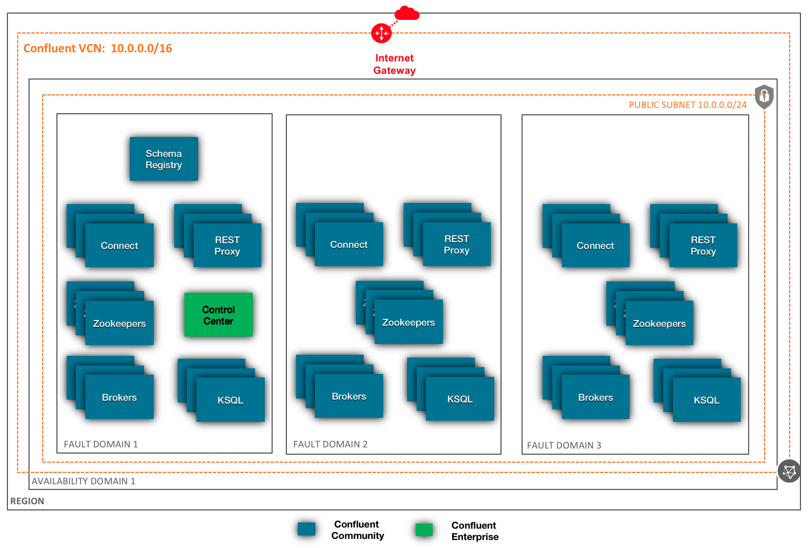
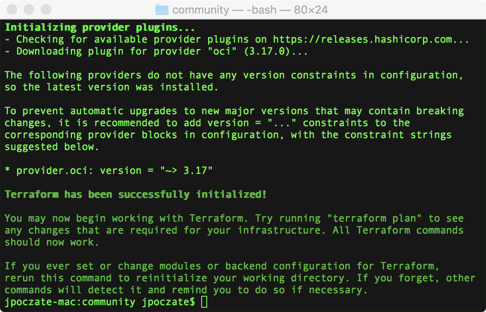
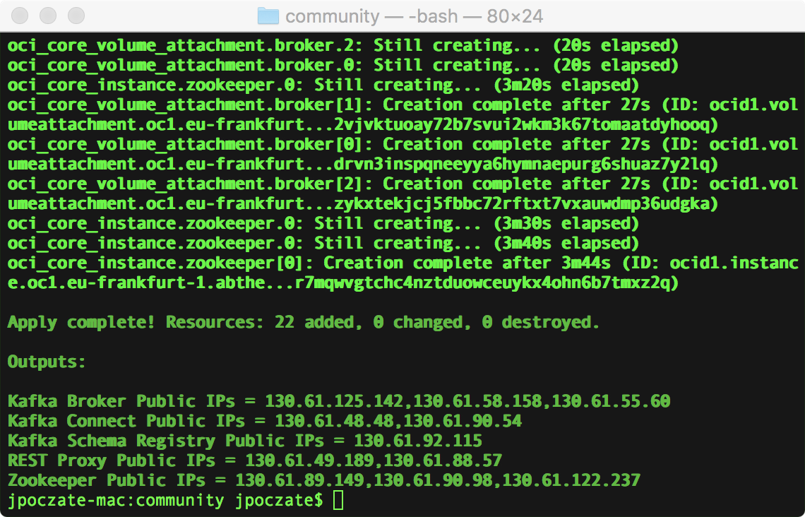
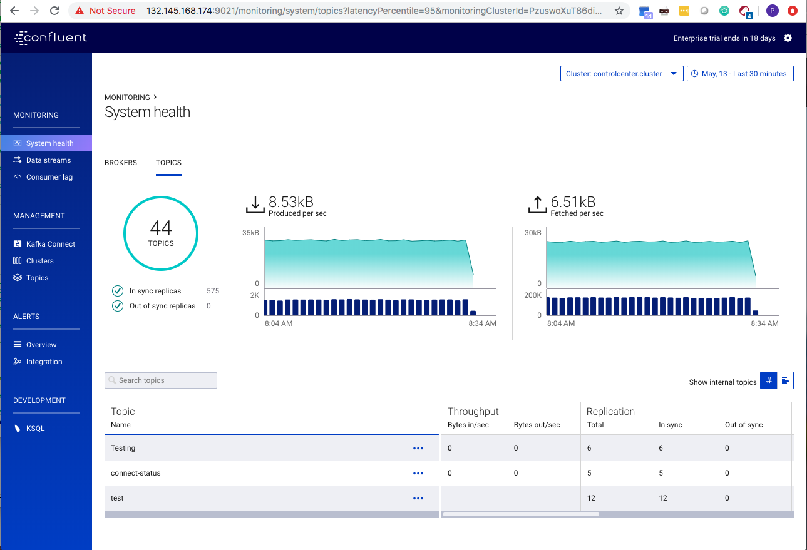
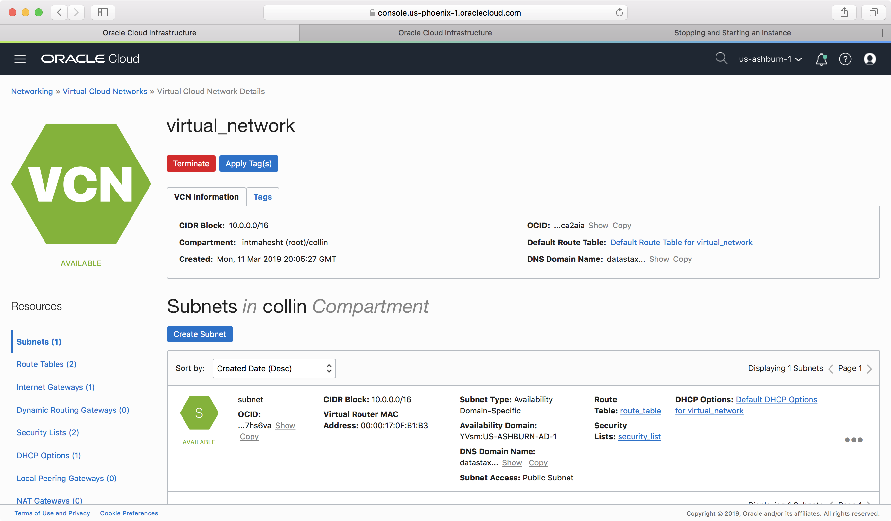
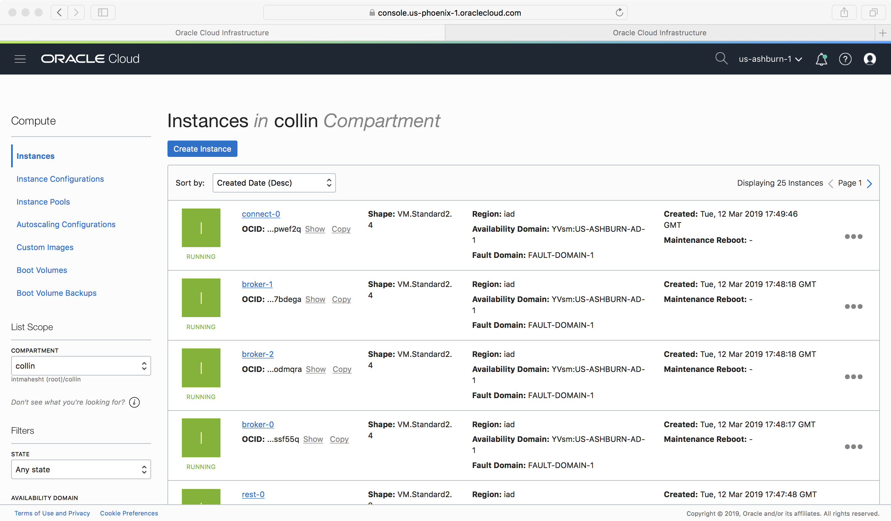

# oci-confluent
These are Terraform modules that deploy [Confluent Platform](https://www.confluent.io/product/confluent-platform/) on [Oracle Cloud Infrastructure (OCI)](https://cloud.oracle.com/en_US/cloud-infrastructure).  They are developed jointly by Oracle and Confluent.

* [community](community) deploys the Community Edition
* [enterprise](enterprise) deploys the Enterprise Edition

## Architecture

## Prerequisites
First off you'll need to do some pre deploy setup.  That's all detailed [here](https://github.com/oracle/oci-quickstart-prerequisites).

## Clone the Module
Now, you'll want a local copy of this repo.  You can make that with the commands:

    git clone https://github.com/oracle/oci-quickstart-confluent.git

If you want to deploy community edition:

    cd oci-quickstart-confluent/community
    ls
    
If you want to deploy enterprise edition (comes with 30 day free trial):

    cd oci-quickstart-confluent/enterprise
    ls

We now need to initialize the directory with the module in it.  This makes the module aware of the OCI provider.  You can do this by running:

    terraform init

This gives the following output:

## Deploy
Now for the main attraction.  Let's make sure the plan looks good:

    terraform plan

That gives:

This command details what will be deployed based on the `variables.tf` file.
If that's good, we can go ahead and apply the deploy:

    terraform apply

You'll need to enter `yes` when prompted.  The apply should take about five minutes to run.  Once complete, you'll see something like this:

When the apply is complete, the infrastructure will be deployed, but cloud-init scripts will still be running.  Those will wrap up asynchronously.  The cluster might take ten minutes.  Now is a good time to get a coffee.

The outputs of the deploy list the public ips of all the deployed instances.
You can ssh into any of the instances by running a command like:

    ssh -i ~/.ssh/oci opc@<instance ip>

## Confluent Control Center
If you installed the enterprise version, you can login to Confluent Control Center.

## View the Cluster in OCI Console
You can also login to the web console [here](https://console.us-phoenix-1.oraclecloud.com/a/compute/instances) to view the IaaS that is running from the
deployment.

Virtual Cloud Network (vcn) page:

Instances page:

## Create Topics, Produce and Consume Messages
First off, let's try creating a topic.

Login to a broker instance:  

    ssh opc@<broker_instance_ip>

Now create a topic by running the command  

    /usr/bin/kafka-topics --zookeeper zookeeper-0:2181 --create --topic demo --partitions 1 --replication-factor 3

Alternatively, if you installed Enterprise Edition, you can create a topic through the Confluent Control Center Web Console.

Now we can try adding a few messages to the topic.  For instance, we can use the REST API to publish 10 messages.  This can be done from any machine which has access to Kafka REST API endpoint.  For example:

    export RPURL=http://rest-0:8082
    curl -X POST -H "Content-Type: application/vnd.kafka.json.v1+json"  --data '{"records":[{"value":{"foo":"bar"}}]}' $RPURL/topics/demo

Now let's trying consuming messages:

    curl -X POST -H "Content-Type: application/vnd.kafka.v1+json" --data '{"name": "ext_consumer_demo","format": "json", "auto.offset.reset": "smallest"}' $RPURL/consumers/c1
    curl -X GET -H "Accept: application/vnd.kafka.json.v1+json" $RPURL/consumers/c1/instances/ext_consumer_demo/topics/demo
