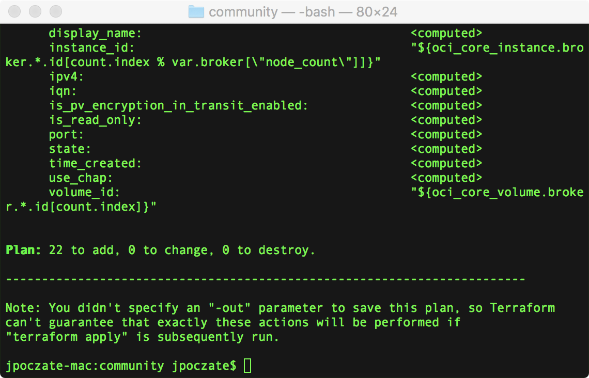

# oci-confluent
These are Terraform modules that deploy [Confluent Platform](https://www.confluent.io/product/confluent-platform/) on [Oracle Cloud Infrastructure (OCI)](https://cloud.oracle.com/en_US/cloud-infrastructure).

* [community](community) deploys the Community Edition

## Prerequisites
First off you'll need to do some pre deploy setup.  That's all detailed [here](https://github.com/cloud-partners/oci-prerequisites).

## Clone the Module
Now, you'll want a local copy of this repo.  You can make that with the commands:

    git clone https://github.com/oci-quickstart/oci-confluent.git
    cd oci-confluent/community
    ls

We now need to initialize the directory with the module in it.  This makes the module aware of the OCI provider.  You can do this by running:

    terraform init

This gives the following output:

## Deploy
Now for the main attraction.  Let's make sure the plan looks good:

    terraform plan

That gives:

This command details what will be deployed based on the `variables.tf` file.
If that's good, we can go ahead and apply the deploy:

    terraform apply

You'll need to enter `yes` when prompted.  The apply should take about five minutes to run.  Once complete, you'll see something like this:

When the apply is complete, the infrastructure will be deployed, but cloud-init scripts will still be running.  Those will wrap up asynchronously.  The cluster might take ten minutes.  Now is a good time to get a coffee.

The outputs of the deploy list the public ips of all the deployed instances.
You can ssh into any of the instances by running a command like:
`ssh -i ~/.ssh/oci opc@<instance ip>`

## View the Cluster in OCI Console
You can also login to the web console [here](https://console.us-phoenix-1.oraclecloud.com/a/compute/instances) to view the IaaS that is running from the
deployment.

Virtual Cloud Network (vcn) page:

Instances page:

